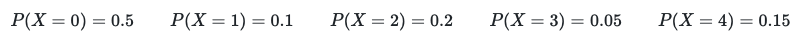

# Generating multinomial trials revisited

We are going to look again at this business of performing a random trial with more than two possible outcomes.  This task in particular will ask you to perform the same exercise as you have just done.  We are going to achieve the same outcome with fewer lines of code.  Remember that we are aiming to sample a random variable with the following probability mass function:

In our last attempt we had to use lots of if statements within our function in order to achieve this.  In  this exercise I would like you to replace all those if statements with a single while statement.   I have defined three variables `myvar` and `accum` that you will need to use within the while statement. I have also set these two quantities equal to the appropriate initial values.  In addition, I have generated a uniform random variable (`myrand`) that is between 0 and 1.  

Your task is to think about how to achieve what all the if statements were achieving in the last exercise by using a while loop instead.
